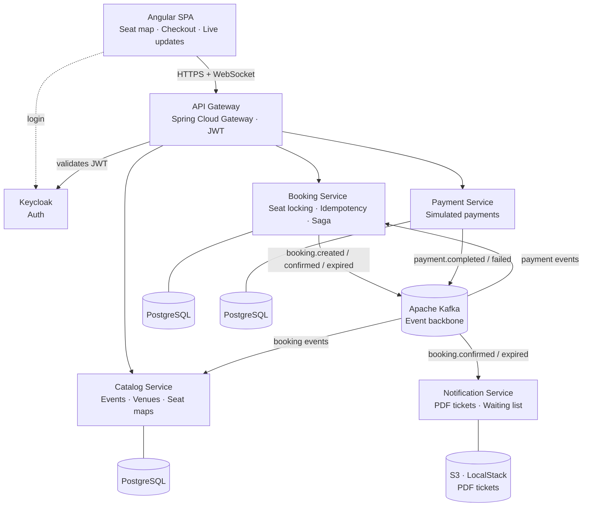

```mermaid
flowchart TD
    UI["️ Angular SPA<br/>Seat map · Checkout · Live updates"]
    GW["API Gateway<br/>Spring Cloud Gateway · JWT"]
    KC["Keycloak<br/>Auth"]

    CAT["Catalog Service<br/>Events · Venues · Seat maps"]
    BOOK["Booking Service <br/>Seat locking · Idempotency · Saga"]
    PAY["Payment Service<br/>Simulated payments"]
    NOTIF["Notification Service<br/>PDF tickets · Waiting list"]

    KAFKA[("Apache Kafka<br/>Event backbone")]

    DB1[("PostgreSQL")]
    DB2[("PostgreSQL")]
    DB3[("PostgreSQL")]
    S3[("S3 · LocalStack<br/>PDF tickets")]

    UI -->|HTTPS + WebSocket| GW
    UI -.->|login| KC
    GW -->|validates JWT| KC
    GW --> CAT
    GW --> BOOK
    GW --> PAY

    CAT --- DB1
    BOOK --- DB2
    PAY --- DB3

    BOOK -->|booking.created / confirmed / expired| KAFKA
    PAY -->|payment.completed / failed| KAFKA
    KAFKA -->|payment events| BOOK
    KAFKA -->|booking events| CAT
    KAFKA -->|booking.confirmed / expired| NOTIF
    NOTIF --- S3
```